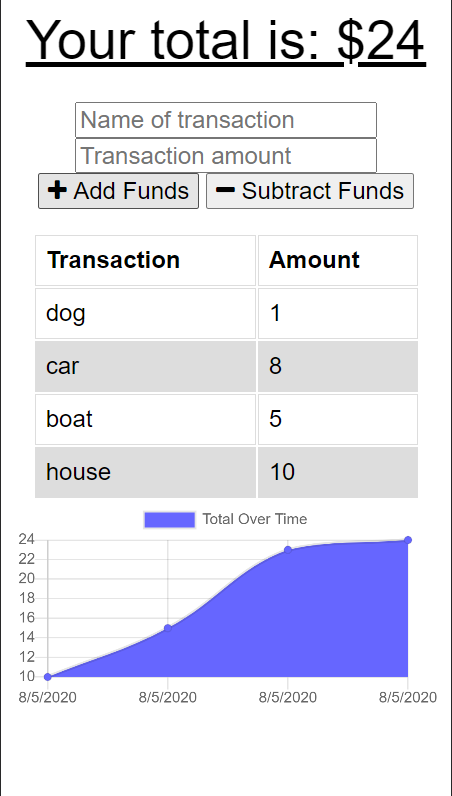

<h1><i>This repo is no longer maintained</i></h1>

# Offline Budget Tracker


## Description

This is a budget tracker PWA that works offline using IndexedDB.

## Table of Contents

- [Installation](#installation)
- [Usage](#usage)
- [Future Enhancements](#future-enhancements)
- [Credits](#Credits)
- [Questions](#questions)

## Installation

```
fork repo
clone to local machine
npm i
run mongod in one terminal instance
in another terminal, run node server
navigate to http://localhost:3000
inspect with dev tools
Application > Service Workers
turn to offline mode
```

## Usage

1. Follow the installation steps to enable offline mode
2. Add transactions or subtract transactions
   

## Future Enhancements

No futher development is planned at this time

## Credits

- Front end files provided by Triology
- [MongoDB](https://www.mongodb.com/)
- IndexedDB

## Questions?

Contact me at [darian.nocera26@gmail.com](mailto:darian.nocera26@gmail.com)

or [](http://www.github.com/darnocer)

Copyright © 2020 [Darian Nocera](http://www.github.com/darnocer)

---

##### _Created with [darnocer's README generator](https://github.com/darnocer/Node.js-and-ES6-README-Generator)_ 👽
